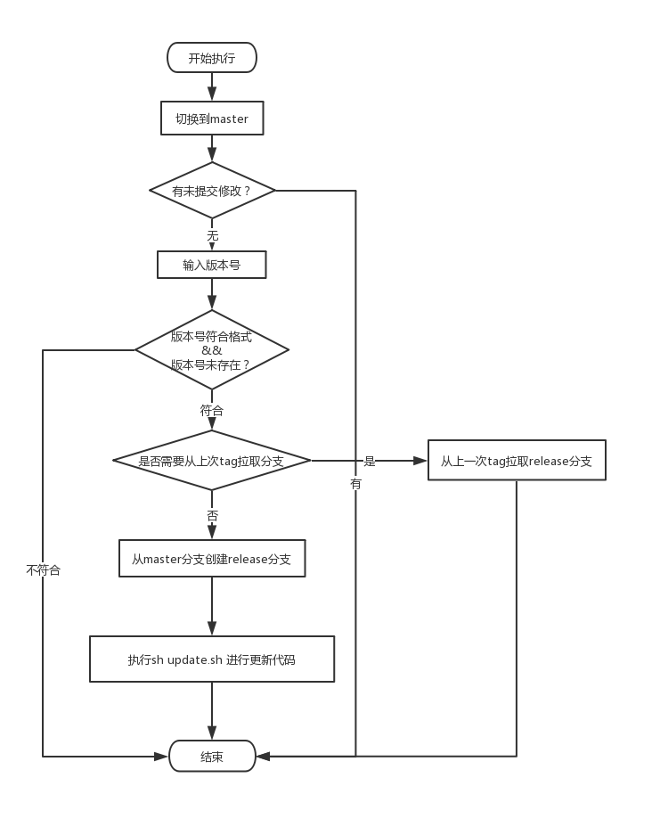
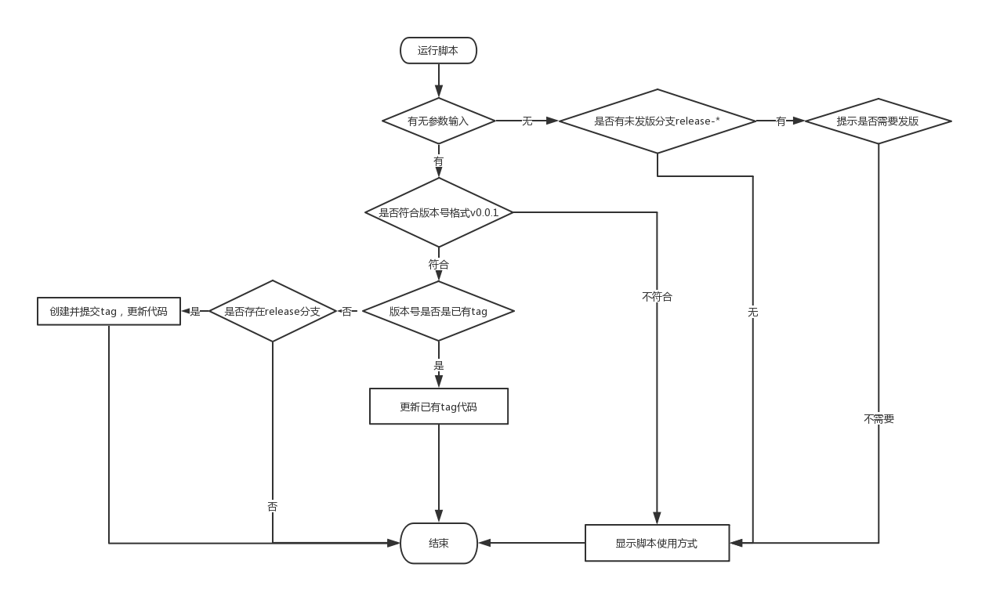

TBD——trunk based development 所用脚本

#### 使用前要做的
update.sh 补全发送地址命令，如rsync等
test.sh 补全测试地址命令

#### 概述

总共写了四个脚本：

- release.sh 发版先执行的脚本。
- update.sh 推送代码到线上的脚本，可以传入已有tag来回退代码，也可以传入新版本VERSION来发新版。
- cherry-pick.sh 方便cherry-pick的脚本。
- test.sh 推送代码到测试地址的脚本。

流程是：
1. 执行sh release.sh
2. 需要cherry-pick的话选择以上一次tag为基准创建release分支
3. cherry-pick之后执行 sh update.sh ${VERSION}
4. 不需要cherry-pick的话不需要执行update.sh

* cherry-pick.sh只是辅助cherry-pick所用
* test.sh作用就是把master分支推到测试地址
* 上述流程要拆成两个脚本，主要考虑是update.sh不仅仅是发版打新tag，也是代码回退到上一个tag的时候执行的脚本

#### release
流程图如下

#### update
流程图如下

#### cherry-pick
写了一个死循环去读master分支的最近十次提交，帮忙执行了一下git cherry-pick，然而并不能帮忙处理冲突[:doge]

#### test
只是推送一下代码
